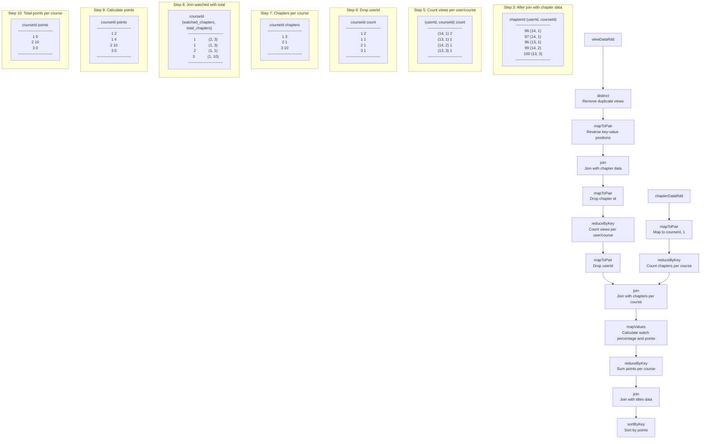

### If we convert all the input csv files to txt files, then we can run it in (isTestMode = false) <br> but when reading from csv format using jsc.textFile we're getting Hadoop's winutils binary error. <br> Why so ?


The issue occurs because when reading CSV files directly with `textFile()`, Spark uses Hadoop's underlying file system implementation which requires native Windows libraries (winutils.exe) for proper file access.

The reason it works with `.txt` files but not `.csv` files is due to how Windows and Hadoop interact:

1. `.txt` files are treated as plain text files and can often be read using simple file I/O
2. `.csv` files trigger Spark's CSV handling logic which uses Hadoop's file system abstraction

To properly handle CSV files on Windows, you have three options:

1. **Use SparkSession and DataFrame API** (Recommended):
```java
SparkSession spark = SparkSession.builder()
        .appName("spark-big-data-exercise")
        .master("local[*]")
        .getOrCreate();

Dataset<Row> titlesDF = spark.read()
        .option("header", "true")
        .csv("src/main/resources/udemy/virtualPairProgrammers/viewingFigures/titles.csv");

JavaPairRDD<Integer, String> titlesRDD = titlesDF.javaRDD()
        .mapToPair(row -> new Tuple2<>(
            row.getInt(0),
            row.getString(1)
        ));
```

2. **Set up Hadoop environment** properly:
```java
System.setProperty("hadoop.home.dir", "C:\\hadoop");
System.setProperty("hadoop.dll.path", "C:\\hadoop\\bin");
```

3. **Use local file system implementation**:
```java
SparkConf sparkConf = new SparkConf()
        .setAppName("spark-big-data-exercise")
        .setMaster("local[*]")
        .set("spark.hadoop.fs.file.impl", "org.apache.hadoop.fs.LocalFileSystem");
```

The DataFrame API approach is recommended as it handles CSV parsing more robustly and has better Windows compatibility.